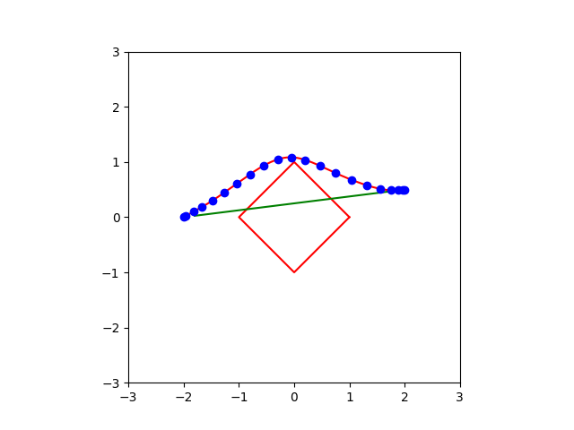

因为 ROS 不能在 macOS 平台运行，所以用 **Matplotlib-for-C++** 重写了可视化模块。

## 编译和运行

```bash
$ cd gcopter_homework
$ cmake -B build
$ cmake --build build
$ ./build/curve_gen
```

## 结果分析

### Workflow and Result

**Workflow**

1. 初始化优化变量 (用 A* 或者直线)
2. 计算代价 Cost = Energy + Potential
3. 用**链式法则**计算梯度 Grad = GradEnergy + GradPotential
4. 调用 L-BFGS 优化直到收敛

**Result**



### Analysis

观察发现，轨迹优化结果**不够平滑**，推测与优化过程过早结束有关，需要助教给点Debug的思路

### Suggestion

1. 用 `Matplotlib` 实现跨平台，希望课程组这边提供跨平台的框架 (ROS 不支持 macOS 和 Windows)
2. 用 `SymPy` 自动求解梯度和代价

```python
import symforce
symforce.set_symbolic_api("sympy")
symforce.set_log_level("warning")
from symforce.notebook_util import display
import symforce.symbolic as sf
```

**计算 Energy**

```python
a = sf.Symbol("a")
b = sf.Symbol("b")
c = sf.Symbol("c")
d = sf.Symbol("d")
s = sf.Symbol("s")
p = a + b * s + c * s ** 2 + d * s ** 3
display(p)
pd = p.diff(s)
display(pd)
pdd = p.diff(s).diff(s)
display(pdd)
display(pdd ** 2)

from sympy import *
energy = integrate(pdd ** 2, (s, 0, 1))
display(energy)
```

$4 c^{2} + 12 c d + 12 d^{2}$

**计算 Potential 及其梯度**

```python
x = sf.Symbol("x")
y = sf.Symbol("y")
ox = sf.Symbol("o_x")
oy = sf.Symbol("o_y")
potential = sqrt((x - ox) ** 2 + (y - oy) ** 2)
display(potential)
```

$\sqrt{\left(- o_{x} + x\right)^{2} + \left(- o_{y} + y\right)^{2}}$

```python
display(potential.diff(x))
display(potential.diff(y))
```

$\frac{- o_{x} + x}{\sqrt{\left(- o_{x} + x\right)^{2} + \left(- o_{y} + y\right)^{2}}}$

$\frac{- o_{y} + y}{\sqrt{\left(- o_{x} + x\right)^{2} + \left(- o_{y} + y\right)^{2}}}$
