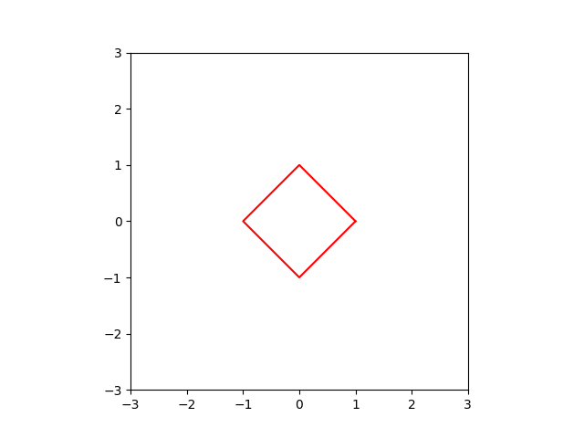
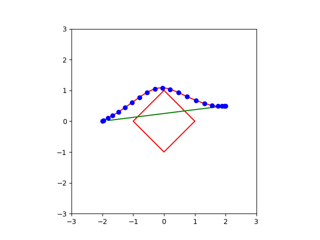

因为 ROS 不能在 macOS 平台运行，所以用 **Matplotlib-for-C++** 重写了可视化模块。

## 编译和运行

```bash
cmake -B build
cmake --build build
./build/curve_gen
```

## 结果分析

### Workflow and Result

简单起见只考虑平面单个四边形的障碍物约束，表示为

$$
Ax \le b,
A = 
\begin{bmatrix}
 1 &  1\\
-1 & -1\\
 1 & -1\\
-1 &  1
\end{bmatrix},
b =
\begin{bmatrix}
1\\
1\\
1\\
1
\end{bmatrix}
$$

障碍物可视化效果



**Workflow**

1. 用起点到终点的直线初始化路径
2. 计算 Energy + Potential 的 Cost + Gradient。与第二章作业方法类似，区别是计算到障碍物的距离。
   - 如果在障碍物里面($Ax \le b$)，需要计算点到边的垂直距离与垂足点
   - 如果在障碍物外面($Ax \ge b$)，需要用 **SDQP** 计算离障碍物的最近点
3. 用**链式法则**计算梯度
4. 调用 **L-BFGS** 求解

**Result**

- 绿线表示初始路径
- 蓝线表示最优路径



**Potential部分实现源码(计算到障碍物距离及其梯度)**

```c++
// ************************* Calculate Potential *************************
Eigen::Matrix2Xd grad_potential;
grad_potential.resize(2, num_inner_points);
grad_potential.setZero();

Eigen::Matrix<double, 4, 2> A;
Eigen::Vector4d b;
A << 1, 1, -1, -1, 1, -1, -1, 1;
b << 1, 1, 1, 1;
const double safe_distance = 0.1;
for (int i = 0; i < num_inner_points; ++i) {
    Eigen::Vector4d A_x = A * inner_points.col(i);
    if (A_x(0) <= b(0)
        && A_x(1) <= b(1)
        && A_x(2) <= b(2)
        && A_x(3) <= b(3)) {
        // Inside Obs
        double min_distance = std::numeric_limits<double>::max();
        Eigen::Vector2d closest_point;
        for (int j = 0; j < 4; ++j) {
            double d_point2line = std::abs(A.row(j) * inner_points.col(i) - b(j))
                                  / A.row(j).norm();
            if (d_point2line < min_distance) {
                min_distance = d_point2line;
                closest_point(0) =
                        A.row(j)(1) *
                        (
                                A.row(j)(1) * inner_points.col(i)(0)
                                - A.row(j)(0) * inner_points.col(i)(1)
                        )
                        + A.row(j)(0) * b(j);
                closest_point(1) =
                        A.row(j)(0) *
                        (
                                -A.row(j)(1) * inner_points.col(i)(0)
                                + A.row(j)(0) * inner_points.col(i)(1)
                        )
                        + A.row(j)(1) * b(j);
                closest_point /= A.row(j).norm();
            }
        }

        cost_total += safe_distance + min_distance;
        Eigen::Vector2d diff = inner_points.col(i) - closest_point;
        grad_potential.col(i) += diff / diff.norm();
    } else {
        // Outside Obs
        /*
         *     min 0.5 x' Q x + c' x,
         *     s.t. A x <= b,
         */
        Eigen::Matrix2d Q;
        Eigen::Vector2d c;
        Eigen::Vector2d closest_point;
        Q << 2, 0, 0, 2;
        c = -2 * inner_points.col(i);
        sdqp::sdqp<2>(Q, c, A, b, closest_point);
        double min_distance = (closest_point - inner_points.col(i)).norm();
        // TODO
        if (min_distance < safe_distance) {
            cost_total += safe_distance - min_distance;
            Eigen::Vector2d diff = inner_points.col(i) - closest_point;
            grad_potential.col(i) += -diff / diff.norm();
        }
    }
    /*
    for (int j = 0; j < instance->convexObstacles.cols(); ++j) {
        Eigen::Vector2d diff =
                inner_points.col(i) - instance->convexObstacles.col(j).head(2);
        double distance = diff.norm();
        double delta = instance->convexObstacles(2, j) - distance;

        if (delta > 0.0) {
            cost_total += delta;
            grad_potential.col(i) += (-diff / distance);
        }
    }
    */
}
```